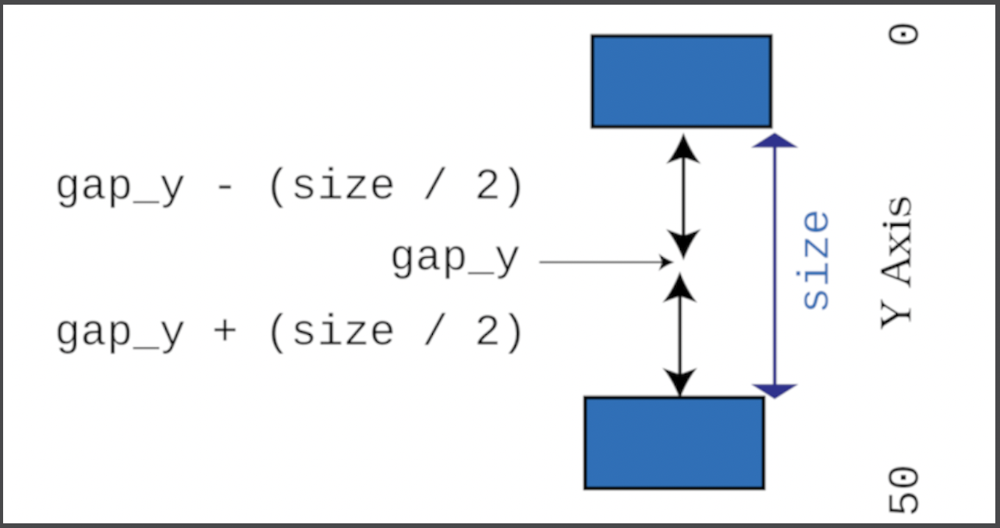

# Flappy Dragon
Flappy Dragon game from "Hands on Rust".

## Design Notes
### Obstacles
#### Obstacle Initialization
Obstacle gaps are centered around a random `y-axis` location and stored in the `gap_y` attribute. The size of the gap is a maximum of 20, but is reduced each time by subtracting the current score. In the game, `x` is initialized to SCREEN_WIDTH. Each time tick this is reduced by 1, which makes the obstacle move right to left towards the character.

```rust
Obstacle {
            x,
            gap_y: random.range(10, 40),
            size: i32::max(2, 20 - score)
        }
```

The image below shows how the above values are related to one another.


#### Obstacle X Location
The player is always rendered at 'x = 5'. The attribute Player.x is used to
'scroll' the obstacles across the screen. Duroing each 'tick' the
Player::gravity_and_move function is called. This increases player.x by 1
each time.

```rust
// From Player Impl
fn gravity_and_move(&mut self) {
        if self.velocity < 2.0 {
            self.velocity += 0.2;
        }
        self.y += self.velocity as i32;
        self.x += 1; // This effects the Obstacle X location

        if self.y < 0 {
            self.y = 0;
        }
    }
```

The Obstacle `x` location is controlled by the line `screen_x = self.x - player_x`.
By decrementing the X position each tick, the obstacle appears to move right to
left across the screen towards the character.
```rust
fn render(&mut self, ctx: &mut BTerm, player_x: i32) {
        let screen_x = self.x - player_x;    <----- player_x incremented each tick
        let half_size = self.size / 2;

        // Draw the top half of the Obstacle
        for y in 0..self.gap_y - half_size {
            ctx.set(
                screen_x,
                y,
                RED,
                BLACK,
                to_cp437('|'),
            );
        }
```
